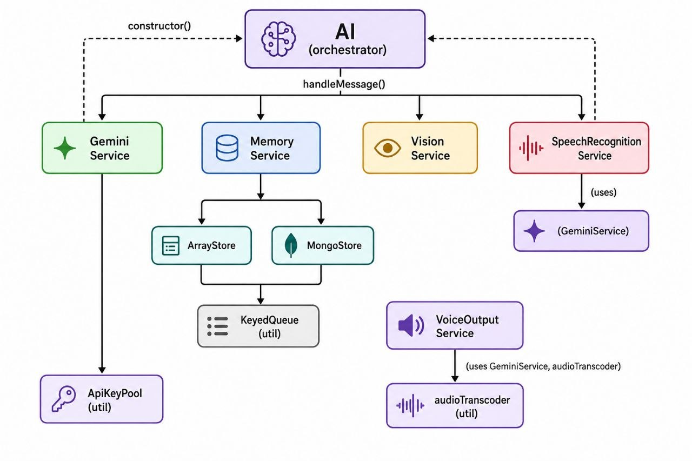

# Architecture

## Overall Architecture

PersonaFlow follows a thin **orchestrator + services** architecture. The public `AI` class (`src/controllers/ai.js`) does not itself talk to Gemini, touch a database, or transcode audio. It coordinates a set of single-responsibility services, each of which owns exactly one concern:



Every service that talks to Gemini does so through `GeminiService` there is exactly one place in the codebase that knows how to call `@google/genai`.

## Module Responsibilities

### `src/controllers/ai.js` `AI` (orchestrator)

- Validates top-level configuration and request shapes.
- Owns the lifecycle of all services: constructs `GeminiService` and `MemoryService` unconditionally; constructs `VisionService`, `SpeechRecognitionService`, and `VoiceOutputService` lazily, only when their `.use...()` method is called.
- Implements the `handleMessage()` control flow: resolve effective input → fetch history → build model contents → generate reply → persist turn → optionally generate voice → assemble response.
- Contains no Gemini API details and no storage details. If either changed entirely (different model provider, different database), this file should need minimal or no changes to its control flow.
- Converts thrown storage-backend errors (e.g. `MongoStore` failing to connect) into the SDK's standard `{ success: false, error, metadata }` shape via `_storageFailureResponse()`, at every point it calls into `MemoryService` history retrieval and persistence in `handleMessage()`, and in `getHistory()`/`deleteHistory()` directly. This keeps the "promise-rejects-only-on-developer-error" contract intact even when the storage backend itself fails operationally.

### `src/services/gemini.js` `GeminiService`

- The sole integration point with `@google/genai`.
- Builds one `GoogleGenAI` client per configured API key at construction time (reused across requests, not recreated per call).
- Merges the internal behavior layer with the developer's persona into a single system instruction (via `src/config/behavior.js`), once per instance.
- Exposes three capability methods, each of which wraps the shared failover logic:
  - `generateReply(contents)` conversational text/vision generation.
  - `transcribeAudio(buffer, mimeType)` speech-to-text.
  - `synthesizeSpeech(text)` text-to-speech (raw PCM).
- Implements `_generateWithFailover()`: the single place where key rotation logic lives, used by all three capability methods above.

### `src/services/memory.js` `MemoryService`

- Presents one storage-agnostic interface (`getHistory`, `getRecentHistoryForModel`, `saveMessage`, `deleteHistory`) to the rest of the SDK.
- Defaults to `ArrayStore`; `useMongo()` swaps the active `_store` to a `MongoStore` instance. The swap is transparent to callers no other code branches on which backend is active.
- Owns the effective `historyLimit`, passing it down to whichever store is constructed.

### `src/services/vision.js` `VisionService`

- Single responsibility: convert an image `Buffer` into a Gemini `inlineData` content part.
- Stateless holds no configuration beyond what's passed per call.
- Errors (e.g. non-Buffer input) are thrown rather than swallowed, so failures are visible at the point of misuse.

### `src/services/speechRecognition.js` `SpeechRecognitionService`

- Thin wrapper around `GeminiService.transcribeAudio()`, fixed to `audio/ogg` input.
- Validates that voice input is a `Buffer` before delegating.

### `src/services/voiceOutput.js` `VoiceOutputService`

- Owns the two pieces of state that make voice output configurable: `includeText` ("should text ride along with audio?") and `probability` ("how often should text be generated") and 
- `shouldGenerateAudio()` performs the per-message random draw against `probability`.
- `generate(text)` calls `GeminiService.synthesizeSpeech()`, then hands the raw PCM to `audioTranscoder` to produce the SDK's public audio output format. The transcoding step happens here, not in `GeminiService`, keeping `GeminiService` unaware of the SDK's public audio format.
- Wraps the transcoding step in a try/catch: if `parseSampleRate()` or `pcmToOggOpus()` throws or rejects, `generate()` returns a structured `{ success: false, error: { code: 'AUDIO_TRANSCODING_ERROR', message }, metadata: { keyIndex, model } }` rather than letting the error propagate as an unhandled rejection consistent with the failure shape every other Gemini-adjacent call in the SDK returns.

### `src/models/arrayStore.js` `ArrayStore`

- Default, in-process storage backend. A `Map<userId, message[]>` scoped to the store instance (and therefore to the owning `AI` instance).
- Enforces `historyLimit` on write (`saveMessage` trims from the front once the cap is exceeded).
- No persistence across process restarts by design, this is the zero-setup default.
- Routes `saveMessage()` and `deleteHistory()` through a per-instance `KeyedQueue`, keyed on `userId`, so the get-mutate-set sequence against the `Map` can't interleave across concurrent calls for the same user and silently lose an update.

### `src/models/mongoStore.js` `MongoStore`

- Persistent storage backend, enabled via `useMemory()`.
- Each instance gets its own Mongoose connection and its own dynamically-named collection, so multiple `AI` instances never share history even when pointed at the same MongoDB URI.
- Connects lazily: the connection promise is created at construction time but only awaited on first use, so `useMemory()` itself stays synchronous while connection errors still surface clearly the first time memory is touched.
- Enforces `historyLimit` on write by deleting excess documents beyond the limit after each insert (rather than capping at read time), keeping the collection itself bounded.
- Routes `saveMessage()` (its insert-then-trim pair) and `deleteHistory()` (its find-then-delete pair) through a per-instance `KeyedQueue`, keyed on `userId`, for the same reason as `ArrayStore` without it, two concurrent calls for the same user could interleave their query-then-delete steps and cause `historyLimit` to be over- or under-enforced.

### `src/utils/keyedQueue.js` `KeyedQueue`

- Serializes async operations per key: calls for the same key run strictly one at a time in call order; calls for different keys run fully concurrently, with no cross-user blocking.
- Used by both `ArrayStore` and `MongoStore`, keyed on `userId`, to make their read-modify-write sequences (save, delete) safe under concurrent `handleMessage()` calls for the same user the specific problem it solves in each is described under their respective entries above.
- Implemented as a promise chain per key (`Map<userId, Promise<void>>`); one operation's failure never blocks or fails the next operation queued behind it only ordering is shared between them, not outcome. Entries are cleaned up once nothing remains queued behind them, so the map doesn't grow unboundedly across every distinct `userId` ever seen.
- Contains no knowledge of storage, Gemini, or any SDK-specific concept it's a generic concurrency primitive, kept in `utils/` rather than `models/` for that reason.

### `src/utils/apiKeyPool.js` `ApiKeyPool`

- Tracks per-key eligibility state (`blacklistedUntil`) for all configured Gemini API keys.
- `getEligibleKeys()` returns keys not currently blacklisted, clearing any expired blacklist entries as a side effect of being asked.
- `blacklist(index)` marks a key ineligible for a fixed duration (`GEMINI_KEY_FAILURE.BLACKLIST_DURATION_MS`).
- Contains no knowledge of HTTP status codes or Gemini-specific error shapes that classification lives in `errorClassification.js`.

### `src/utils/errorClassification.js`

- Pure functions: `isRotatableFailure(err)` decides whether an error should trigger key rotation; `classifyErrorCode(err)` maps an error to a stable, public error code.
- Kept separate from `ApiKeyPool` and `GeminiService` so the "what counts as a rotatable failure" policy is defined in exactly one place and independently testable.

### `src/utils/audioTranscoder.js`

- Wraps the `ffmpeg-static` binary directly (via `child_process.spawn`) rather than a wrapper library, to transcode raw PCM (as returned by Gemini TTS) into the output audio.
- `parseSampleRate(mimeType)` extracts the sample rate Gemini reports (e.g. `audio/L16;codec=pcm;rate=24000`) so transcoding uses the correct input rate rather than an assumed constant.

### `src/config/defaults.js`

- Single source of truth for tunable constants: default history limit, model names per capability, voice output defaults, and key-failure/blacklist policy.
- Nothing in the SDK hardcodes a model name or limit outside this file.

### `src/config/behavior.js`

- Defines `CONVERSATIONAL_BEHAVIOR`, the fixed internal system-instruction text that enforces natural, reactive, non-robotic conversational style.
- `buildSystemInstruction(persona)` concatenates the behavior layer with the developer's persona this is the only place the two are combined, and it happens once per `GeminiService` instance, not per request.

## Request Flow

`handleMessage({ userId, text?, image?, voice? })`:

1. **Validate** the request shape (`_validateHandleMessageRequest`). Throws synchronously on structural problems this happens before any async work.
2. **Resolve effective input.**
   - If `voice` is present: require `SpeechRecognitionService` to be enabled, transcribe it, and use the transcription as the effective text for the rest of the flow.
   - If `image` is present: require `VisionService` to be enabled (checked, but the actual image part is built later).
3. **Fetch history** for `userId` via `MemoryService.getRecentHistoryForModel()` full history up to the configured limit, in chronological order.
   - **On storage failure:** return `{ success: false, error: { code: 'STORAGE_ERROR', ... }, metadata }` immediately, via `_storageFailureResponse()`.
4. **Build contents**: map stored history into Gemini `Content[]` shape, then append the current turn (text and/or image part) as the final `user` entry.
5. **Generate reply** via `GeminiService.generateReply(contents)`, which internally runs the failover loop across eligible API keys.
   - **On failure:** return `{ success: false, error, metadata }` immediately. Nothing is persisted.
6. **Persist the turn**: save the user's effective text and the model's reply text as a pair via `MemoryService.saveMessage()`, called twice (user, then model).
   - **On storage failure:** return `{ success: false, error: { code: 'STORAGE_ERROR', ... }, metadata }` via `_storageFailureResponse()`, carrying through the already-succeeded reply's `apiKeyIndex`/`rotated`/`keysTriedThisRequest` so the caller can see which key served the turn, even though the reply text itself is not returned.
7. **Optionally generate voice**: if `VoiceOutputService` is enabled and its probability roll succeeds, call `generate(reply.text)`.
   - **On failure:** return `{ success: false, error, metadata }` this covers both a failed Gemini TTS call and a failed PCM→OGG/Opus transcoding step (`error.code: 'AUDIO_TRANSCODING_ERROR'`) after a successful TTS call. Either way, even though the text reply itself succeeded, the overall call is reported as failed, since voice generation was expected for that turn.
8. **Assemble the response** (`_buildResponse`): merge token usage, key-rotation metadata (preferring the voice-output call's rotation info if audio was generated, since it was the last Gemini call made that turn), response time, finish reason, and per-capability model names. Attach `audio` and/or `text` depending on whether voice output ran and whether `includeText` is set.

## Configuration Flow

```
new AI(config)
  │
  ├─ validate apiKeys, persona, historyLimit
  ├─ new GeminiService(apiKeys, persona)
  │     ├─ buildSystemInstruction(persona)   [config/behavior.js]
  │     └─ one GoogleGenAI client per key
  ├─ new MemoryService(historyLimit)
  │     └─ defaults to new ArrayStore(historyLimit)
  ├─ _vision = null
  ├─ _speechRecognition = null
  └─ _voiceOutput = null

ai.useMemory(mongoUri)
  └─ MemoryService.useMongo(mongoUri, 'personaflow_history')
        └─ swaps _store to new MongoStore(...)   [connects lazily]

ai.useVision()
  └─ _vision = new VisionService()

ai.useSpeechRecognition()
  └─ _speechRecognition = new SpeechRecognitionService(this._gemini)

ai.useVoiceOutput(options)
  ├─ validate probability, includeText
  ├─ resolve default probability from includeText if not given
  └─ _voiceOutput = new VoiceOutputService(this._gemini, { probability, includeText })
```

Configuration is deliberately one-directional and additive: `.use...()` calls only add capability, never remove it, and the base instance is always valid on its own.

## Storage Design

`MemoryService` depends on an interface, not a concrete backend:

| Method                                | Contract                                                                               |
| ------------------------------------- | -------------------------------------------------------------------------------------- |
| `saveMessage(userId, { role, text })` | Appends a message; enforces `historyLimit`; serialized per `userId`                    |
| `getHistory(userId, {limit?})`          | Returns messages, chronological order, optionally capped                               |
| `deleteHistory(userId, {limit?})`       | Deletes all history, or only the most recent `limit` messages; serialized per `userId` |

Both `ArrayStore` and `MongoStore` implement this identically from the caller's perspective, returning `{ role, text, createdAt }` records. The two backends differ only in _where_ the enforcement and trimming happen:

- **`ArrayStore`** trims in memory on every write (`slice` to the last `historyLimit` entries).
- **`MongoStore`** trims by querying and deleting excess documents after every write (`skip(historyLimit)` then delete), and connects to MongoDB lazily on first real use rather than at construction.

This split is intentional: an in-memory array can cheaply re-slice on every write, while a database-backed store should avoid holding the full history in memory just to trim it, and instead let the database do the filtering.

Both backends' write paths (`saveMessage`, `deleteHistory`) are read-modify-write sequences read current state, then write a new state derived from it and both route those sequences through a `KeyedQueue` keyed on `userId` (see `src/utils/keyedQueue.js` above). Without this, two `handleMessage()` calls arriving concurrently for the same `userId` could interleave their read and write steps: in `ArrayStore`, one write's mutation could be silently overwritten by the other's stale `.set()`; in `MongoStore`, two trims racing against each other could delete more or fewer documents than `historyLimit` actually allows. Serializing per `userId` (not globally) closes this without introducing unnecessary contention between different users' unrelated requests.

## Folder Structure

```
personaflow/
├── index.js                        # Public entry point  exports AI
├── package.json
├── examples/
│   └── basic.js                    # Minimal usage example (not part of the build)
└── src/
    ├── controllers/
    │   └── ai.js                   # AI orchestrator (public API surface)
    ├── services/
    │   ├── gemini.js                # Sole @google/genai integration point
    │   ├── memory.js                # Storage-agnostic history coordinator
    │   ├── vision.js                # Image → Gemini content part
    │   ├── speechRecognition.js     # Voice input → text
    │   └── voiceOutput.js           # Text → OGG/Opus audio
    ├── models/
    │   ├── arrayStore.js            # In-memory history backend (default)
    │   └── mongoStore.js            # MongoDB history backend
    ├── utils/
    │   ├── apiKeyPool.js            # Key eligibility / blacklist tracking
    │   ├── errorClassification.js   # Rotatable-failure and error-code policy
    │   ├── audioTranscoder.js       # PCM → OGG/Opus via ffmpeg-static
    │   └── keyedQueue.js            # Per-userId async serialization for stores
    └── config/
        ├── defaults.js              # Tunable constants (models, limits, policy)
        └── behavior.js              # Internal conversational-behavior layer
```

`controllers/` holds the one public-facing orchestrator. `services/` holds feature logic. `models/` holds storage backends. `utils/` holds small, pure, or narrowly-scoped helpers with no orchestration responsibility. `config/` holds static configuration and text, not logic.

## Design Principles (Implementation-Level)

- **One integration point per external system.** All Gemini calls go through `GeminiService`; all Mongo calls go through `MongoStore`. No other file imports `@google/genai` or `mongoose`.
- **Failover is a cross-cutting concern, implemented once.** `_generateWithFailover()` in `GeminiService` is shared by `generateReply`, `transcribeAudio`, and `synthesizeSpeech` none of them re-implement rotation logic.
- **Services don't know about each other, except where explicitly composed.** `VisionService` and `SpeechRecognitionService` don't reference each other. Where a service does need another (`SpeechRecognitionService` and `VoiceOutputService` both need `GeminiService`), it's passed in explicitly at construction no shared global state, no service locator.
- **Validation lives at the boundary.** Constructor and `handleMessage()` validate inputs before any service is touched or any async work begins, so configuration and request errors are synchronous and immediate.
- **Nothing optional is constructed until asked for.** `_vision`, `_speechRecognition`, and `_voiceOutput` start `null`; only the corresponding `.use...()` call instantiates them. This keeps unused features at zero runtime and memory cost.
- **A promise only rejects on developer error.** Operational failures a rate-limited key, an unreachable database, a failed audio transcode always resolve with a structured `{ success: false, error, metadata }` object, at every layer, not just at the top-level Gemini call. This is enforced even for failures that occur _after_ another step has already succeeded (e.g. storage failing after a good model reply, or transcoding failing after a good TTS call), so the shape of a `handleMessage()`, `getHistory()`, or `deleteHistory()` result is predictable regardless of where in the pipeline something went wrong.
- **Concurrency safety is scoped to what actually needs it.** Where a read-modify-write sequence exists (`ArrayStore`/`MongoStore` writes), it's serialized per `userId` via `KeyedQueue` rather than with a single instance-wide lock protecting against the real race (two calls for the same user interleaving) without introducing artificial contention between unrelated users.
